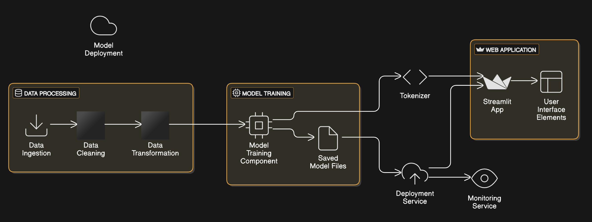
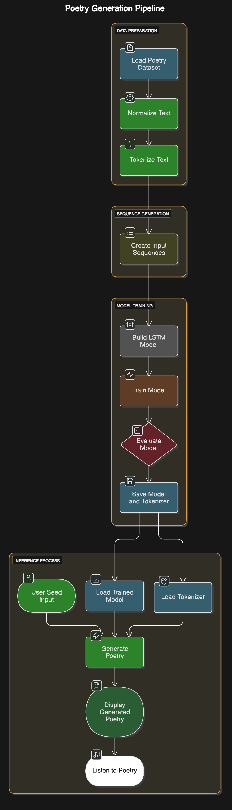

# Roman Urdu Poetry Generation Model


## System Architecture



A deep learning model that generates Roman Urdu poetry using LSTM neural networks. This project includes both the model training pipeline and a user-friendly web interface for generating poetry.

## 📋 Table of Contents
- [Overview](#overview)
- [Features](#features)
- [Demo](#demo)
- [Project Structure](#project-structure)
- [Installation](#installation)
- [Usage](#usage)
- [Model Architecture](#model-architecture)
- [Training Process](#training-process)
- [Results](#results)
- [Future Improvements](#future-improvements)
- [Contributing](#contributing)
- [License](#license)

## 🔍 Overview

This project uses deep learning to generate Urdu poetry in Roman script. It employs a sequence-to-sequence LSTM model trained on a dataset of Roman Urdu poetry. The model learns patterns, rhythms, and language structures from existing poetry to generate new, creative verses.

## ✨ Features

- **Poetry Generation**: Generate Urdu poetry in Roman script from seed words or phrases
- **Customizable Output**: Control the length of generated poetry
- **User-friendly Interface**: Easy-to-use Streamlit web application
- **Text-to-Speech**: Listen to the generated poetry (browser-based)
- **Temperature Control**: Adjust the creativity/randomness of the generated text

## 🎮 Demo

To use the poetry generator:

1. Run the Streamlit app using `streamlit run app.py`
2. Enter a seed word or phrase (e.g., "Muhabbat" for love)
3. Adjust the number of words to generate
4. Click "Generate Poetry"
5. View and listen to the generated verses

## 📁 Project Structure

```
Poetry-Generation-Model/
├── app.py                       # Streamlit web application
├── model-training.ipynb         # Jupyter notebook with model training code
├── requirements.txt             # Python dependencies
├── roman_urdu_poetry_model.keras # Trained model file
├── tokenizer.pkl                # Tokenizer for text processing
└── README.md                    # This documentation file
```

## 📥 Installation

1. Clone the repository:
   ```bash
   git clone https://github.com/yourusername/Poetry-Generation-Model.git
   cd Poetry-Generation-Model
   ```

2. Install dependencies:
   ```bash
   pip install -r requirements.txt
   ```

## 🚀 Usage

### Running the Web Application

```bash
streamlit run app.py
```

This will start the Streamlit server and open the application in your default web browser.

### Using the Model Programmatically

You can also use the model directly in your Python code:

```python
import tensorflow as tf
import pickle
import numpy as np

# Load model and tokenizer
model = tf.keras.models.load_model("roman_urdu_poetry_model.keras", 
                                  custom_objects={"perplexity": perplexity})
with open("tokenizer.pkl", "rb") as handle:
    tokenizer = pickle.load(handle)

# Generate poetry function (see app.py for implementation details)
# ...
```

## Data Flow



## 🧠 Model Architecture

The poetry generation model uses a sequence-to-sequence architecture with:

- Embedding layer (128 dimensions)
- Stacked LSTM layers (256 units each)
- Dropout for regularization (0.3)
- Dense output layer with softmax activation

The model is designed to predict the next word in a sequence, which allows it to generate poetry one word at a time.

## 🔄 Training Process

The model was trained using:

- A dataset of Roman Urdu poetry
- Text preprocessing including normalization and tokenization
- Sequence generation for training data
- Adam optimizer with learning rate scheduling
- Early stopping and learning rate reduction to prevent overfitting
- Custom perplexity metric for evaluation

The training process is documented in detail in the `model-training.ipynb` notebook.

## 📊 Results

The model achieves:

- Training perplexity: ~330
- Validation perplexity: ~3400

While the validation perplexity is high, the model still produces coherent and creative poetry. The high perplexity is expected due to the creative nature of poetry generation.

## 🔮 Future Improvements

Potential enhancements for the project:

- Incorporate attention mechanisms for better context awareness
- Implement beam search for improved text generation
- Add more poetry styles and formats
- Improve the UI with additional customization options
- Expand the training dataset for better generalization

## 👥 Contributing

Contributions are welcome! Please feel free to submit a Pull Request.

1. Fork the repository
2. Create your feature branch (`git checkout -b feature/amazing-feature`)
3. Commit your changes (`git commit -m 'Add some amazing feature'`)
4. Push to the branch (`git push origin feature/amazing-feature`)
5. Open a Pull Request

## 📄 License

This project is licensed under the MIT License - see the LICENSE file for details.

---

Created with ❤️ for Urdu poetry and machine learning
